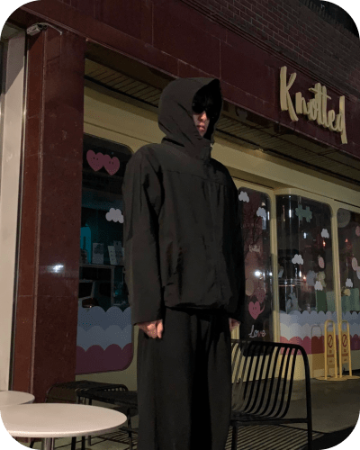

# 모아 Project


## 프로젝트 소개

사용자가 국내 여행을 기록하고 방문한 장소별로 스탬프를 찍어 추억을 남길 수 있는 디지털 플랫폼입니다.

#### 📅 프로젝트 기간 : 2024.10.21 ~ 2024.11.21

#### 💻 배포 링크 : [MOA 바로가기](https://stamp-moa.vercel.app/)

#### 🏠 팀 노션 : [팀 노션 바로가기](https://www.notion.so/teamsparta/8-bf17275ec94f4ac988eb0362363e3df6)

---

### 선정 배경

최근 통계에 따르면, 전 세계적 팬데믹 상황과 경제적 불안정성으로 인해 해외여행 수요가 급감하고 있으며, 이에 따라 가성비 좋은 국내 여행에 대한 관심이 높아지고 있습니다. 특히 ‘YOLO’(You Only Live Once) 트렌드에서 'YO NO’(해외여행을 자제하는 경향)로 변화하는 사회적 흐름이 이를 뒷받침합니다.

이러한 흐름 속에서 모아 Project는 사용자가 국내 숨은 명소와 다양한 관광지를 찾아 나서는 여정을 돕고, 이를 기록으로 남기며 공유할 수 있는 공간을 제공합니다. 사용자들은 지역별 스탬프를 모으고, 방문한 장소에 대한 사진을 포토 앨범에 업로드하여 여행의 추억을 한곳에 모을 수 있습니다. 이 과정을 통해 사용자들은 단순한 여행 기록을 넘어, 자신만의 여행 컬렉션을 구축하는 재미를 느낄 수 있습니다.

모아 Project는 이러한 디지털 여행 기록 방식을 통해 사용자가 국내여행을 새롭고 의미 있게 즐길 수 있도록 돕고자 합니다.

---

### 기획 의도

- **특화 포인트**  
  국내 여행 활성화를 위해 전국의 숨은 명소와 지역 특색이 담긴 다양한 관광지를 소개하며, 사용자들의 여행 의욕을 북돋고 국내 여행 소비를 촉진합니다.

- **차별화된 내용**  
  스탬프 투어 기능을 모바일 기기로 손쉽게 이용할 수 있으며, 사용자는 방문한 각 지역마다 스탬프를 수집할 수 있어 여행 기록이 하나의 컬렉션으로 남습니다. 여행 도중 스탬프를 찍는 경험 자체가 또 다른 재미 요소로 작용하여 사용자들이 자연스럽게 여행을 기록하고 공유할 수 있습니다.

---

## 🏗️ 아키텍쳐


---

## 📚 기술 스택

### 프레임워크 및 라이브러리


### 상태 관리


### 서버리스


### 패키지 매니저


### 협업 툴


### 버전 관리


### 배포


---

## **기술적 의사결정**

| 기술 스택                     | 선택 이유                                                                                                                                                                                  |
| ----------------------------- | ------------------------------------------------------------------------------------------------------------------------------------------------------------------------------------------ |
| **Next.js**                   | 서버 사이드 렌더링(SSR)과 정적 사이트 생성(SSG)을 지원하여 초기 로딩 속도와 SEO에 유리하며, 파일 기반 라우팅으로 별도의 설정 없이도 직관적인 페이지 관리를 제공하여 선택하였습니다.        |
| **Typescript**                | 정적 타입 검사로 안정적인 개발환경과 타입을 미리 지정해 자동 완성, 타입 체크 등 개발 효율성을 높일 수 있어서 선택했습니다.                                                                 |
| **React Hook Form**           | 비제어 컴포넌트 기반으로 폼 상태를 성능 최적화하고 입력 검증을 효율적으로 관리하고자 선택했습니다.                                                                                         |
| **Kakao map api**             | 사용자들이 찍은 스탬프를 지도를 통해 시각적으로 보여주기 위해 선택했습니다.                                                                                                                |
| **browser image compression** | 앨범 이미지 업로드 시 파일 크기를 줄여 업로드 성능을 개선하고 저장 공간을 효율적으로 사용하기 위해 선택했습니다.                                                                           |
| **Supabase**                  | 백엔드 인프라를 직접 구축하지 않고도 API 생성, 인증, 파일 스토리지, 실시간 데이터 동기화 등의 기능을 제공하여 빠르게 애플리케이션을 개발할 수 있어 선택하였습니다.                         |
| **Zustand**                   | 전역 상태를 간편하게 관리하며, 보일러 플레이트가 단순하여 빠르게 환경 설정이 가능하고 컴포넌트 간 데이터 흐름을 최적화하여 효율적인 데이터 관리가 가능해 선택하였습니다.                   |
| **TanStack Query**            | 자동 캐싱과 동기화를 통해 네트워크 요청을 줄이고 성능을 향상시키며, 로딩과 에러 상태 관리가 용이하고 자동으로 재시도 및 업데이트를 처리하여 편리하게 로직을 작성할 수 있어 선택하였습니다. |
| **Vercel**                    | GitHub와 연동하여 코드 푸시 시 자동으로 빌드와 배포가 이루어져 CI/CD 프로세스를 간편하게 설정할 수 있어 선택하였습니다.                                                                    |
| **Tailwind CSS**              | 유틸리티 우선 접근 방식으로 미리 정의된 클래스를 활용하여 일관된 스타일링이 가능하며, CSS 파일 없이도 빠르고 유연하게 디자인을 적용할 수 있어 개발 생산성이 높아 선택하였습니다.           |

---

## 🪖 팀원

<table>
   <tr>
    <td align="center"><b>Frontend</b></td>
    <td align="center"><b>Frontend</b></td>
    <td align="center"><b>Frontend</b></td>
    <td align="center"><b>Frontend</b></td>
    <td align="center"><b>Designer</b></td>
  </tr>
  <tr>
      <td align="center"></td>   
    <td align="center"></td>
    <td align="center"></td>
    <td align="center"></td>
    <td align="center"></td>
  </tr>
  <tr>
      <td align="center"><b><a href="https://github.com/kyulipark">팀장 : 송혜인</a></b></td>
    <td align="center"><b><a href="https://github.com/lim-bora">팀원 : 임보라</a></b></td> 
    <td align="center"><b><a href="https://github.com/smu06030">팀원 : 유인철</a></b></td> 
    <td align="center"><b><a href="https://github.com/kyulipark">팀원 : 박규리</a></b></td>
    <td align="center"><b><a href="https://six-gemini-258.notion.site/f119c1aef2284269b6cc15a65a8d60bb">팀원 : 김재범</a></b></td>
  </tr>
</table>

---

## 🏠 역할 소개

### 전국팔도 8조

| 이름       | 역할     | 담당 기능                                                                                                   |
| ---------- | -------- | ----------------------------------------------------------------------------------------------------------- |
| **송혜인** | 리더     | 관광지 목록, 관광지 상세, 공공API, 카카오맵 API                                                             |
| **임보라** | 부리더   | Geolocation API, 스탬프 목록, 스탬프 상세 페이지, 앨범 목록, 앨범 상세페이지, 지역별 필터링, 레이아웃, CRUD |
| **유인철** | 팀원     | 카카오맵 API, 메인페이지, 추천여행지 목록, 추천여행지 상세페이지, CRUD                                      |
| **박규리** | 팀원     | 회원가입, 로그인(소셜로그인), 마이페이지, 레이아웃                                                          |
| **김재범** | 디자이너 | 웹/모바일 디자인, 배너, 아이콘, 로고, 브로셔 디자인                                                         |

---

## 📚 주요 기능

### 🗺️ 스탬프 서비스


#### **스탬프 지도 페이지**

- 지역별 카테고리를 슬라이드하여 특정 지역을 선택할 수 있습니다.
- 찍은 스탬프의 위치를 표시하여 지역별 스탬프 현황을 확인하고, 클릭 시 해당 장소의 정보를 제공합니다.
- **전체 스탬프 목록 페이지**로 이동할 수 있습니다.

#### **스탬프 찍는 페이지**

- 사용자의 현재 위치를 기반으로 해당 지역의 스탬프를 찍을 수 있습니다.
- 찍은 스탬프는 사용자가 별명을 지정하여 쉽게 추억할 수 있습니다.

#### **스탬프 목록 페이지**

- 17개의 지역별 스탬프가 활성화/비활성화 상태로 표시되어 사용자 소유 스탬프 현황을 한눈에 파악할 수 있습니다.
- 비활성화된 스탬프가 활성화되며 모으는 재미를 더했습니다.
- 활성화된 스탬프를 누르면 **상세 페이지**로 이동합니다.

#### **지역별 스탬프 상세 페이지**

- 활성화된 스탬프의 이미지와 처음 찍은 일시, 주소, 총 개수를 제공합니다.
- 히스토리 드롭다운에서 해당 지역에서 찍은 스탬프의 장소 정보를 확인할 수 있습니다.

---

### 🚎 지역별 관광지 소개


#### **관광지 목록 페이지**

- 전국의 관광지 정보를 키워드별, 지역별로 확인할 수 있습니다.
- 각 관광지별 **북마크 기능**을 제공하며, 저장한 관광지는 마이페이지에서 확인할 수 있습니다.

#### **관광지 상세 페이지**

- 해당 관광지의 운영 시간, 주차 여부, 휴일 등 주요 정보를 확인할 수 있습니다.
- 위치와 상세 정보도 함께 제공하여 여행 계획을 쉽게 세울 수 있습니다.

---

### 🌉 포토앨범 기록


#### **포토앨범 페이지**

- 사용자가 특정 지역의 사진을 업로드해 여행의 추억을 앨범으로 모을 수 있습니다.
- 이미지를 확대하거나 슬라이드 방식으로 앨범을 감상할 수 있어 추억을 쉽게 돌아볼 수 있습니다.

---

### 👣 마이페이지


#### **마이페이지 기능**

- 사용자 닉네임을 변경할 수 있으며, 찜한 여행지, 모은 스탬프 현황, 업로드한 사진 갯수를 한눈에 확인할 수 있습니다.
- **최근 여행지**와 **과거의 오늘**을 슬라이드 형식으로 볼 수 있어 개인화된 여행 기록을 제공합니다.

---

### 😀 로그인/회원가입


- 구글, 카카오 계정으로 **소셜 로그인**이 가능합니다.
- 이메일과 비밀번호 유효성 검사를 통해 가입 여부를 체크합니다.
- 아이디/비밀번호 찾기 기능을 제공하며, **자동 로그인**으로 편리한 사용 경험을 제공합니다.

---

## 🛠 트러블슈팅

<details>
<summary style="cursor: pointer; font-size: 16px;">1. Icon</summary>

### **🔥 이슈**

기존에는 아이콘을 각각 만들어서 **`중복되는 코드`** 들이 너무 많은 문제가 있었습니다.


### 기존 코드

```tsx
const AlbumIcon = () => {
  return (
    <svg width="28" height="28" viewBox="0 0 28 28" fill="none" xmlns="<http://www.w3.org/2000/svg>">
      <path
          fillRule="evenodd"
          clipRule="evenodd"
          d="...."
          fill=black
      />
    </svg>
  );
};
```

### **✅ 해결**

path 크기를 **동적으로 렌더링**하고 **배경색과 아이콘 반경을 조정**할 수 있게 수정하였습니다.

```tsx
import { ICONS } from '@/constants/icons';

interface IconProprType {
  name: keyof typeof icons;
  size?: number;
  color?: string;
  bgColor?: string;
  rx?: string;
}

const Icon = ({ name, size = 28, color = 'black', bgColor, rx }: IconProprType) => {
  const icon = ICONS[name];

  // 사이즈 동적 조절
  const scale = size >= 28 ? size / 28 : 1;

  return (
    <svg
      width={size}
      height={size}
      viewBox={`0 0 ${size} ${size}`}
      fill="none"
      xmlns="<http://www.w3.org/2000/svg>"
      className="flex items-center justify-center"
    >
      {bgColor && <rect width={size} height={size} rx={rx} fill={bgColor} />}
      <g transform={`scale(${scale})`}>
        <path fillRule="evenodd" clipRule="evenodd" d={icon} fill={color} />
      </g>
    </svg>
  );
};

export default Icon;
```

</details>
<details>
<summary style="cursor: pointer; font-size: 16px;">2. Modal</summary>

### **🔥 이슈**

**Modal 반복 사용**

모달창을 구현하다 보니 다양한 컴포넌트에서 **`동일한 모달 로직을 반복적으로 사용하는 문제`** 가 있었습니다.

### **✅ 해결**

useModal 커스텀 훅 분리를 이용한 모달 상태 관리와 포탈 렌더링을 분리해 사용해서 **재사용성**과 **가독성**을 높일 수 있었습니다.

```tsx
import { useCallback, useEffect, useState } from 'react';
import { createPortal } from 'react-dom';

const useModal = () => {
  const [isOpen, setIsOpen] = useState(false);
  const [portalElement, setPortalElement] = useState<HTMLElement | null>(null);

  useEffect(() => {
    if (typeof window !== 'undefined') {
      setPortalElement(document.getElementById('overlays'));
    }
  }, [isOpen]);

  const openModal = useCallback(() => setIsOpen(true), []);
  const closeModal = useCallback(() => setIsOpen(false), []);

  const Modal = ({ children }: { children: React.ReactNode }) => {
    if (!isOpen || !portalElement) return null;

    return createPortal(
      <div
        onClick={closeModal}
        style={{ zIndex: 999, backgroundColor: 'rgba(53, 53, 53, 0.6)' }}
        className="fixed inset-0"
      >
        {children}
      </div>,
      portalElement
    );
  };

  return { isOpen, openModal, closeModal, Modal };
};

export default useModal;
```

</details>

## 🔥 성능 최적화

<details>
<summary style="cursor: pointer; font-size: 16px;">1. 메인 FCP, LCP 단축</summary>
  
### 🔥 **이슈**

lighthouse 측정 결과를 통해 메인 지도 이미지 LCP가 지연돼 **초기 렌더링이 느리다는 문제**를 발견했습니다.

### 🔎 **해결 과정**

Next.js의 `<Image />` 는 최적화된 이미지 렌더링 기능을 제공하지만 원본 이미지 파일이 큰 경우 로딩 시간이 길어질 수 있는 문제가 있었습니다.

### ✅ **해결 방법**

메인 지도 이미지를 압축해 기존 대비 `-65%` **이미지 용량을 감소** 시켰습니다.


이미지 용량을 줄이면서 `FCP`, `LCP` 지표가 모두 개선이 되면서 **초기 로딩 시간도 단축**시켜 **사용자 경험을 향상**할 수 있었습니다.


</details>

<details>
<summary style="cursor: pointer; font-size: 16px;">2. 초기 렌더링 시간 단축</summary>
  
### 🔥 **이슈**

스탬프 데이터를 가져올 때 클라이언트에서 가져오기 때문에 속도가 느린 문제가 있었습니다.

### 🔎 **해결 과정**

초기 렌더링 속도를 개선하기 위해 클라이언트가 아닌 서버에서 데이터를 미리 패칭해 클라이언트로 보내는 방식을 적용해봤습니다.

**서버에서 데이터를 미리 패치**

```tsx
const user = await getUser();

if (user) {
  await queryClient.prefetchQuery({
    queryKey: QUERY_KEY.STAMP_LIST(user.id),
    queryFn: () => getStampList(user.id)
  });
}
```

**데이터 직렬화**

```tsx
<HydrationBoundary state={dehydrate(queryClient)}>
```

`dehydrate`를 사용해 queryClient상태를 **JSON 형식으로 변환**해 클라이언트에서 `HydrationBoundary`를 사용해 데이터를 복원했습니다.

### ✅ **해결 방법**

기존에는 클라이언트 컴포넌트에서 `Tanstack Query` 를 사용해 데이터를 패칭했습니다.

```tsx
const MainComponent = () => {
  const userId = useUserId();
  const { data: tourismList, isPending isError } = useGetTourismListQuery(userId);

  ...
}
```

리팩토링 후에는 `HydrationBoundary`와 `dehydrate`를 활용해 스탬프 페이지를 최적화 했습니다.

```tsx
// layout.tsx

export default async function StampLayout({ children }: { children: React.ReactNode }) {
  const queryClient = new QueryClient({
    defaultOptions: {
      queries: {
        staleTime: 1000
      }
    }
  });

  const user = await getUser();

  if (user) {
    await queryClient.prefetchQuery({
      queryKey: QUERY_KEY.STAMP_LIST(user.id),
      queryFn: () => getStampList(user.id)
    });
  }

  return (
    <HydrationBoundary state={dehydrate(queryClient)}>
      <MapProvider>{children}</MapProvider>
    </HydrationBoundary>
  );
}
```

</details>

<details>
<summary style="cursor: pointer; font-size: 16px;">3. 앨범 이미지 압축 및 파일변환</summary>

### 🔥 **이슈**

앨범에서 처음 사용자가 이미지를 올릴 때 용량제한을 두지 않아 이미지 용량이 크고 양이 많아질수록 페이지 로드되는 속도가 현저히 낮아지는 문제가 있었습니다.

### 🔎 문제점

- 압축 또는 이미지 최적화 없이 전달받은 이미지 그대로 업로드
- 반복적이고 불필요한 상태 업데이트

**이전 코드**

```tsx
// 이미지 파일받기
const OnChangePhoto = (e: ChangeEvent<HTMLInputElement>) => {
  if (onClickUserCheck(e)) return;

  // 1. 압축 또는 이미지 최적화 없이 전달받은 이미지 그대로 업로드
  const files = e.target.files;
  setCurrentRegion(e.target.id.split('-')[1]);
  if (!files) return;

  Array.from(files).forEach((file) => {
    const fileReader = new FileReader();
    fileReader.readAsDataURL(file);

    fileReader.onload = (e) => {
      // 2. 반복적이고 불필요한 상태 업데이트
      if (typeof e.target?.result === 'string' && e.target.result) {
        if (activeTab === 'allTab') {
          setImgSrc((prev) => [...prev, e.target!.result as string]);
          // setIsRigionModal(true);
          openModal();
        } else if (activeTab === 'rigionTab') {
          setImgSrc((prev) => [...prev, e.target!.result as string]);
          setRegionCate(item);
        }
      }
    };
  });
};
```

### ✅ **해결 방법**

- 파일 읽기와 압축을 병렬로 처리하여 전체시간을 단축했습니다.
  - `Promise.all` 사용해 파일 압축 & 읽기
    - 병렬로 처리하면 하나 끝날때까지 안기다리고 여러개를 동시에 처리가 가능해 시간단축이 가능하고, 코드의 가독성을 향상시켰습니다.
- `browser-image-compression` \*\*\*\*이미지압축 라이브러리를 통해 압축하여 이미지용량을 제한하였습니다.
- 효율적인 이미지 압축과 고화질을 유지하고자 **AVIF형식으로 변환하였습니다.**
  - **AVIF형식**은 JPEG, PNG, 또는 WebP와 비교했을때 매우 높은 압축률로 파일크기를 줄일 수 있고, 높은 화질을 제공하여 앨범의 주 컨텐츠인 이미지의 깨짐을 최소화할 수 있습니다.

```tsx
const imgSrcArray: string[] = await Promise.all(
  //Promise.all 병렬로 처리
  Array.from(files).map(async (file) => {
    // 파일 압축
    const compressedImage = await imageCompression(file, {
      maxSizeMB: 1, // 1MB
      maxWidthOrHeight: 1024, // 이미지의 최대 가로 또는 세로 길이를 1024로 제한
      useWebWorker: true // 압축 작업이 메인 스레드에 영향을 미치지 않도록 설정
    });

    // 압축파일 AVIF 형식으로 변환 (convertImageToAvif() : AVIF 변환함수)
    const avifImage = await convertImageToAvif(compressedImage);

    // 압축된 AVIF 파일읽기
    return new Promise<string>((resolve) => {
      const reader = new FileReader();
      reader.readAsDataURL(avifImage);
      reader.onload = () => {
        if (typeof reader.result === 'string') {
          resolve(reader.result);
        }
      };
    });
  })
);
```

- 상태 업데이트를 최소화하여 불필요한 랜더링을 방지하였습니다

```tsx
// 상태 업데이트를 한 번에 처리
setImgSrc((prev) => [...prev, ...imgSrcArray]);

if (activeTab === 'allTab') {
  openModal();
} else if (activeTab === 'rigionTab') {
  setRegionCate(item);
}
```

### **As-is )**


### **TO-BE )**


</details>
